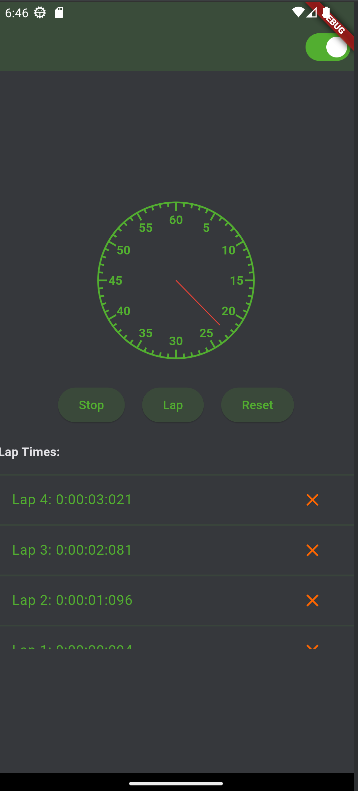

## Stopwatch app

Creating this app was a test first and foremost, but also a gigantic learning opportunity.

Before I started working on this app, I have never touched flutter or dart, and it was done in 2 and a half days. There may be some issues originating from my lack of experience in dart, but i do believe it showcases my learning skills and general development knowledge to some degree.

I tried to take advantage of that and made this app without using any outside packages or libraries other than what flutter provides (even though the test allowed the use of using a premade analog clock).

It is a fairly simple stopwatch, but it can do what any other stopwatch should be capable of doing. Keeping track of time, resetting itself and saving lap-times.

The analog clock widget is customizable to a fairly high extent. Design wise the colors are coordinated using the theme of the applications. The number of clockhands/arms are completely dynamic, as well as how fast each individual are capable of mnaking a full revolution. To keep up with the arm speeds customizability , the numbers on the clock are also custom and can be controlled by the range you provide. This made it easy to add 2 separate analog clocks to my app, one with a range of 60 for the standard stopwatch and one with 12, like any normal clock would have.

The app has been tested on an actual android device and works as intended.

